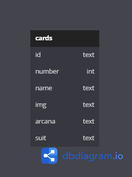

# Labeddit Back End

## Índice

* [Introdução](#introdução)
* [Tecnologias utilizadas](#tecnologias-utilizadas)
* [Aplicações utilizadas](#aplicações-utilizadas)
* [Banco de Dados](#banco-de-dados)
* [Documentação](#documentação)
* [Rodando o projeto](#rodando-o-projeto)
* [Autora](#autora)

## Introdução
- Projeto de uma API que retorna as cartas de tarot.

## Tecnologias utilizadas

1. ``Node.js``
2. ``Typescript.js``
3. ``Knex``
4. ``Express``
5. ``SQLite``
6. ``POO``
7. ``Arquitetura em camadas``
8. ``Geração de UUID``
9. ``Geração de hashes``
10. ``Autenticação e autorização``
11. ``Roteamento``
12. ``Jest``

## Aplicações utilizadas
- Postman
- Render

## Banco de Dados

 
## Documentação
https://documenter.getpostman.com/view/24460767/2s935hSTcw

## Rodando o projeto
- Rode o console na pasta em que você baixou os arquivos;

- Insira o comando ``npm install``;

- Depois, o comando ``npm run dev`` para rodar na porta 3003.

## Autora

<table>
  <tr>
    <td align="center">
      <a href="https://github.com/paulajardimf">
         
        
          <b>Paula Jardim</b>
        
      </a>
    </td>
  </tr>
</table>
